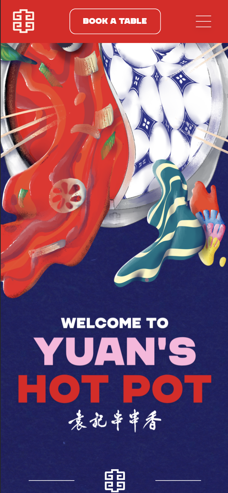
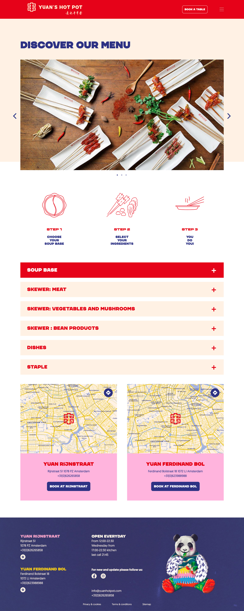
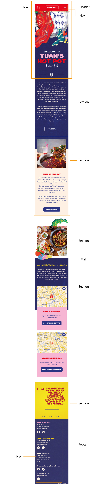
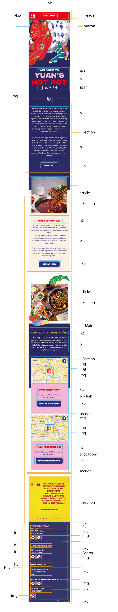

# Procesverslag
Markdown is een simpele manier om HTML te schrijven.  
Markdown cheat cheet: [Hulp bij het schrijven van Markdown](https://github.com/adam-p/markdown-here/wiki/Markdown-Cheatsheet).

Nb. De standaardstructuur en de spartaanse opmaak van de README.md zijn helemaal prima. Het gaat om de inhoud van je procesverslag. Besteedt de tijd voor pracht en praal aan je website.

Nb. Door *open* toe te voegen aan een *details* element kun je deze standaard open zetten. Fijn om dat steeds voor de relevante stuk(ken) te doen.

## Jij

uitwerken voor kick-off werkgroep

### Auteur:
Xiao Nan Pols

#### Je startniveau:
Rood

#### Je focus:
Responsive. Om mijzelf uit te dagen wil ik ook elementen toevoegen van de surface plane. Maar als hoofdoel is Responsive. 
 

## Je website

uitwerken voor kick-off werkgroep

### Je opdracht:
https://yuanhotpot.com
Ik zou graag een paar design aanpassingen willen doen. Bijvoorbeeld: De header heeft geen content, daar wil ik de titel naar verplaatsen. 

#### Screenshot(s) van de eerste pagina (small screen): 
hier de naam van de pagina  

#### Screenshot(s) van de tweede pagina (small screen):
hier de naam van de pagina  

 

## Breakdownschets (week 1)

uitwerken na afloop 2e werkgroep

### de hele pagina: 

### dynamisch deel: 

<!-- ### wellicht nog een dynamisch deel (bijv filter): 
 -->

## Voortgang 1 (week 2)

uitwerken voor 1e voortgang

### Stand van zaken
Ik ben begonnen met HTML en dat ging eigenlijk prima. Het was niet lastig,
alleen heb ik feedback van of mijn HTML goed is. 

### Agenda voor meeting
samen met je groepje opstellen

| Xiao Nan       | Tijn               | Kevin        | Bram             |
| ---            | ---                | ---          | ---              |
| aria label     | geen               | backgroundimg|                  |
| feedback HTML  |                    | figcaption   |                  |
| ...            | ...                |              | ...              |

### Verslag van meeting
hier na afloop snel de uitkomsten van de meeting vastleggen

- Samantische HTML
- Aria label
- H2 weg halen met class van website: https://www.a11yproject.com/posts/2013-01-11-how-to-hide-content/
- IMG naast een button
- IMG in HTML zonder dat het wordt vastgelegd in de HTML

## Voortgang 2 (week 3)

uitwerken voor 2e voortgang

### Stand van zaken
Het stijlen van mijn HTML gaat goed. Ik had een paar vragen, maar die werden opgelost tijdens de les.

### Agenda voor meeting
samen met je groepje opstellen

| Xiao Nan       | Tijn               | Kevin        | Bram             |
| ---            | ---                | ---          | ---              |
| slider boven   |                    |              |                  |
| randje foto    | ...                |              | ...              |
| js + aanspreke | ...                |              | ...              |

### Verslag van meeting
hier na afloop snel de uitkomsten van de meeting vastleggen

- Ik kreeg antwoorden op mijn vragen en was begonnen met het toepassen ervan. 

## Toegankelijkheidstest (week 4)

uitwerken na test in 8e voortgang

### Bevindingen
Lijst met je bevindingen die in de test naar voren kwamen:

#### Tunnel vissie
Focus raak je kwijt, hamburgermenu moet je zoeken om hem goed te kunnen zien. Kleuren vallen wel op

Oplossing: Icons groter doen voor voorbeeld hamburgermenu probleem

#### Wazig met staar
Effect van plaatjes gaan weg. Tekst in zwart zie je niet, wit zie je ook niet maar is wel wat duidelijker

Effectere plaatjes als gebruiker instelt als hij deze beperking heeft.

#### Vlekjes met Spongebob
Je ziet zowat niks. Je ziet wel een titel. Maar voor de rest zie je niet. Als je een afbeelding hebt met veel kleur, is dat best heftig. 

Spongebob alleen: Tekst groter maken

#### Concentratie probleem
Opvallende dingen die je wel, maar tekst bijvoorbeeld zie je niet

Oplossing: tekst groter maken

#### Voice over
Over het algemeen werkt mijn site goed met een voice over. Alleen leest hij niet het menu bij het openklap menu.
Voice over die praat Nederlands en Engels door elkaar. Engels is wel met de goede stem. Maar het is evengoed verwarrend maar dat komt omdat mijn laptop Nederlands is. 

Oplossing: Keydown bij openklap menu

#### Tab
Tab toets werkt goed. Alleen moet je 6x tabben om uit de nav te gaan. Dit komt door het menu. 

Oplossing: Keydown, maar dan blijf je in menu en gaat hij niet weg.

## Voortgang 3 (week 4)

uitwerken voor 3e voortgang

### Stand van zaken
Ik heb niet verder gewerkt aan de website van donderdag tot vrijdag.

### Agenda voor meeting
samen met je groepje opstellen

| Xiao Nan       | Tijn               | Kevin        | Bram             |
| ---            | ---                | ---          | ---              |
| JS             |                    | foto         | @media           |
| foto           |                    |              |                  |
| ...            | ...                | ...          | ...              |

### Verslag van meeting
hier na afloop snel de uitkomsten van de meeting vastleggen

- Docent gaf antwoord op mijn vragen en ga die verwerken in mijn website
- Rubric bekijken
- Verder werken aan website
- ...

## Eindgesprek (week 5)

uitwerken voor eindgesprek

### Stand van zaken
Over het algemeen ging het goed. Met behulp van de lessen en student assistentes kon ik mijn website helemaal voor elkaar krijgen. 

### Screenshot(s)

hier screenshot(s) van je eindresultaat

## Bronnenlijst

continu bijhouden terwijl je werkt

Nb. Wees specifiek ('css-tricks' als bron is bijv. niet specifiek genoeg).

1. Google fonts
2. H1/H2 animatie: https://codepen.io/deannabosschert/pen/NWaqJVE?editors=1111
3. Hotpot slider: https://codepen.io/shooft/pen/zYKEyrN
4. Tafel boeken structuur: https://codepen.io/xiao-nan-pols/pen/dyzrpWV
5. Reset CSS: http://meyerweb.com/eric/tools/css/reset/ 
6. Sfeer-foto after/before: https://stackoverflow.com/questions/8977957/can-i-change-the-height-of-an-image-in-css-before-after-pseudo-elements
7. Scroll snap: https://css-tricks.com/practical-css-scroll-snapping/
8. Scrollbar hidden: https://www.w3schools.com/howto/howto_css_hide_scrollbars.asp

