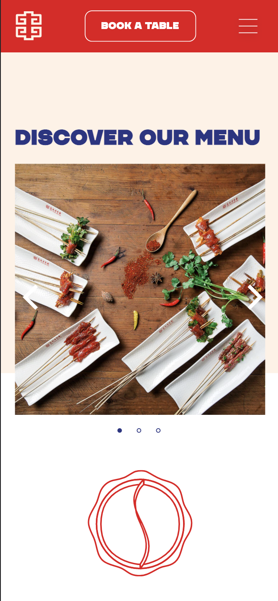

# Procesverslag
Markdown is een simpele manier om HTML te schrijven.  
Markdown cheat cheet: [Hulp bij het schrijven van Markdown](https://github.com/adam-p/markdown-here/wiki/Markdown-Cheatsheet).

Nb. De standaardstructuur en de spartaanse opmaak van de README.md zijn helemaal prima. Het gaat om de inhoud van je procesverslag. Besteedt de tijd voor pracht en praal aan je website.

Nb. Door *open* toe te voegen aan een *details* element kun je deze standaard open zetten. Fijn om dat steeds voor de relevante stuk(ken) te doen.

## Jij

uitwerken voor kick-off werkgroep

### Auteur:
Xiao Nan Pols

#### Je startniveau:
Rood

#### Je focus:
Responsive. Om mijzelf uit te dagen wil ik ook elementen toevoegen van de surface plane. Maar als hoofdoel is Responsive. 
 

## Je website

uitwerken voor kick-off werkgroep

### Je opdracht:
https://yuanhotpot.com
Ik zou graag een paar design aanpassingen willen doen. Bijvoorbeeld: De header heeft geen content, daar wil ik de titel naar verplaatsen. 

#### Screenshot(s) van de eerste pagina (small screen): 
hier de naam van de pagina  

#### Screenshot(s) van de tweede pagina (small screen):
hier de naam van de pagina  

 

## Breakdownschets (week 1)

uitwerken na afloop 2e werkgroep

### de hele pagina: 

### dynamisch deel: 

<!-- ### wellicht nog een dynamisch deel (bijv filter): 
 -->

## Voortgang 1 (week 2)

uitwerken voor 1e voortgang

### Stand van zaken
Ik ben begonnen met HTML en dat ging eigenlijk prima. Het was niet lastig,
alleen heb ik feedback van of mijn HTML goed is. 

### Agenda voor meeting
samen met je groepje opstellen

| Xiao Nan       | Tijn               | Kevin        | Bram             |
| ---            | ---                | ---          | ---              |
| aria label     | geen               | backgroundimg|                  |
| feedback HTML  |                    | figcaption   |                  |
| ...            | ...                |              | ...              |

### Verslag van meeting
hier na afloop snel de uitkomsten van de meeting vastleggen

- Samantische HTML
- Aria label
- H2 weg halen met class van website: https://www.a11yproject.com/posts/2013-01-11-how-to-hide-content/
- IMG naast een button
- IMG in HTML zonder dat het wordt vastgelegd in de HTML

## Voortgang 2 (week 3)

uitwerken voor 2e voortgang

### Stand van zaken
Het stijlen van mijn HTML gaat goed. Ik had een paar vragen, maar die werden opgelost tijdens de les.

### Agenda voor meeting
samen met je groepje opstellen

| Xiao Nan       | Tijn               | Kevin        | Bram             |
| ---            | ---                | ---          | ---              |
| Link styles    |                    |              |                  |
| JS Menu        |                    |              |                  |
| ...            | ...                |              | ...              |

### Verslag van meeting
hier na afloop snel de uitkomsten van de meeting vastleggen

- punt 1
- punt 2
- nog een punt
- ...

## Toegankelijkheidstest (week 4)

uitwerken na test in 8e voortgang

### Bevindingen
Lijst met je bevindingen die in de test naar voren kwamen:

#### Titel eerste bevinding
Hier korte omschrijving (met indien nodig een afbeelding)

Hier een omschrijving van hoe het opgelost kan worden (met indien nodig een afbeelding)

#### Titel tweede bevinding. 
Hier korte omschrijving (met indien nodig een afbeelding)

Hier een omschrijving van hoe het opgelost kan worden (met indien nodig een afbeelding)

#### Titel volgende bevinding. 
Hier korte omschrijving (met indien nodig een afbeelding)

Hier een omschrijving van hoe het opgelost kan worden (met indien nodig een afbeelding)

#### Titel nog een bevinding. 
Hier korte omschrijving (met indien nodig een afbeelding)

Hier een omschrijving van hoe het opgelost kan worden (met indien nodig een afbeelding)

## Voortgang 3 (week 4)

uitwerken voor 3e voortgang

### Stand van zaken
hier dit ging goed & dit was lastig (neem ook screenshots op van delen van je website en code)

### Agenda voor meeting
samen met je groepje opstellen

| student 1      | student 2          | student 3    | student 4        |
| ---            | ---                | ---          | ---              |
| dit bespreken  | en dit             | en ik dit    | en dan ik dat    |
| en dat ook nog | dit als er tijd is | nog een punt | dit wil ik zeker |
| ...            | ...                | ...          | ...              |

### Verslag van meeting
hier na afloop snel de uitkomsten van de meeting vastleggen

- punt 1
- punt 2
- nog een punt
- ...

## Eindgesprek (week 5)

uitwerken voor eindgesprek

### Stand van zaken
hier dit ging goed & dit was lastig (neem ook screenshots op van delen van je website en code)

### Screenshot(s)

hier screenshot(s) van je eindresultaat

## Bronnenlijst

continu bijhouden terwijl je werkt

Nb. Wees specifiek ('css-tricks' als bron is bijv. niet specifiek genoeg).

1. bron 1
2. bron 2
3. ...

